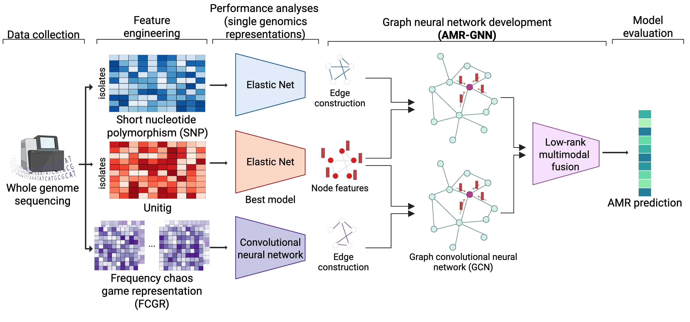

# AMR-GNN: A multi-representation graph neural network framework to enable genomic antimicrobial resistance prediction

This is the code repository of the [paper](https://www.biorxiv.org/)

## Overview of AMR-GNN Workflow


## Installation
We use `uv` to manage Python environment and install tools used for this work. Please refer [here](https://docs.astral.sh/uv/getting-started/installation/) to install `uv`.

Install essential tools:

```bash
uv tool add gdown snakemake
```

## Docker images
We use Docker to containerise AMR-GNN codebase. First, clone this repository and navigate to the project directory.

```bash
git clone https://github.com/andyvng/amr-gnn.git && \
cd amr-gnn
```

Build the Docker image:

```bash
docker build -f Dockerfile -t amrgnn:latest .
```

## Data preprocessing
We provide a Snakemake workflow for generating feature inputs from genome assemblies. You will need to provide the list of selected unitigs from Elastic Net, an annotated reference genome for variant calling, and a CSV file detailing the positions of curated AMR genes on the reference genome. To execute the workflow, place all genome assemblies into a single directory and ensure the file extension is correctly specified (default: `.fasta`). The pipeline will automatically detect all assemblies within the target directory and generate the corresponding node features and adjacency matrices.

The following files need to be specified in the [config file](./preprocess/config.yaml) to run the pipeline:

| Argument                               | Description | 
|----------------------------------------|-------------|
| assemblies_dir  | Input directory containing genome assemblies |
| reference_genome | Annotated reference genome (e.g., PAO1 genome) |
| unitig_list | Unitig list (with header) selected by Pyseer's elastic net. One unitig per line |
| position_fp | Position of selected AMR genes on the reference genome for FCGR feature extraction |
| keep_proportion | Retention proportion based on the total number of possible edges |

Run the pipeline

```
cd preprocess
snakemake --cores 'all'
```

## Train AMR-GNN model
As an example to train AMR-GNN and perform AMR prediction afterwards, we provide real-world data (BV-BRC database) for predicting vancomycin resistance in <em>Enterococcus faecium</em>. Please download the dataset and mount this `data` folder to the Docker container to perform training.

```bash
gdown 1KZlLvAF8jPyPk2YkW-LNbqb0gFUmu7rS
tar -xzvf data.tar.gz && rm data.tar.gz
```

The `data` folder contains the AST label files, the ids of *E. faecium* isolates included in the study, the selected unitigs for node features, two adjancency matrices derived from SNPS and FCGR features. Here is the structure of the `data` folder

<p align="center">
  
</p>


Train AMR-GNN for predicting vancomycin resistance

```
docker run --rm \
           -v ${PWD}/data:/amrgnn/data \
           -v ${PWD}/experiments:/amrgnn/experiments \
           amrgnn:latest \
           src/train.py \
           data.input_dir=data/extracted_unitigs \
           data.antimicrobial=vancomycin \
           data.labels=data/ast_labels.csv \
           data.whole_ids=data/whole.ids \
           data.train_ids=data/train.ids \
           data.val_ids=data/val.ids \
           adj_matrix.file_path_1=data/fcgr_adj_matrix.csv \
           adj_matrix.file_path_2=data/snps_adj_matrix.csv \
           trainer.model_checkpoint.dirpath=experiments/checkpoints 
```

Here, we used [Hydra](https://hydra.cc) to manage configuration settings. For the full list of configuration settings, please see [here](./conf/config.yaml)

## Predict AMR phenotype
Load trained model to predict vancomycin resistance.
```
docker run --rm \
           -v ${PWD}/data:/amrgnn/data \
           -v ${PWD}/experiments:/amrgnn/experiments \
           amrgnn:latest \
           src/predict.py \
           data.input_dir=data/extracted_unitigs \
           data.antimicrobial=vancomycin \
           data.labels=data/ast_labels.csv \
           data.whole_ids=data/whole.ids \
           data.predict_ids=data/predict.ids \
           adj_matrix.file_path_1=data/fcgr_adj_matrix.csv \
           adj_matrix.file_path_2=data/snps_adj_matrix.csv \
           trainer.model_checkpoint.dirpath=experiments/checkpoints \
           prediction.outdir=experiments/results
```

The output files (`prediction_results.csv`) is a csv file including 4 columns

| Column                               | Description | 
|----------------------------------------|-------------|
| isolate_ids  | Isolate id |
| y_true | True AST phenotype (Resistant/Susceptible) |
| y_proba | Predicted probability from AMR-GNN |
| y_pred | Predicted AST phenotype (Resistant/Susceptible) |

## Model interpretation

We used Integrated Gradients for feature attribution, utilizing the reference genome's unitig features as the baseline.

```
docker run --rm \
           -v ${PWD}/data:/amrgnn/data \
           -v ${PWD}/experiments:/amrgnn/experiments \
           amrgnn:latest \
           src/explain.py \
           data.input_dir=data/extracted_unitigs \
           data.antimicrobial=vancomycin \
           data.labels=data/ast_labels.csv \
           data.whole_ids=data/whole.ids \
           adj_matrix.file_path_1=data/fcgr_adj_matrix.csv \
           adj_matrix.file_path_2=data/snps_adj_matrix.csv \
           trainer.model_checkpoint.dirpath=experiments/checkpoints \
           explainer.outfp="experiments/explain/IG_attribution.csv"
```

The output consists of a CSV file comprising a matrix of IG scores, where rows represent isolates and columns represent features.


## Citation
```
@article {Nguyen2025.07.24.666581,
	author = {Nguyen, Hoai-An and Peleg, Anton Y. and Wisniewski, Jessica A. and Wang, Xiaoyu and Wang, Zhikang and Blakeway, Luke V. and Badoordeen, Gnei Z. and Theegala, Ravali and Doan, Nhu Quynh and Parker, Matthew H. and Green, Anna G. and Song, Jiangning and Dowe, David L. and Macesic, Nenad},
	title = {AMR-GNN: A multi-representation graph neural network framework to enable genomic antimicrobial resistance prediction},
	year = {2025},
	doi = {10.1101/2025.07.24.666581},
	URL = {https://www.biorxiv.org/content/early/2025/07/27/2025.07.24.666581},
	journal = {bioRxiv}
}
```